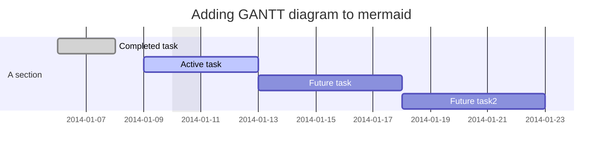

# info
:+1:

- [x] IPC für S:\318. iwis Laserschweissanlage MIDI richten (Lars)
- [x] Matthias alter Laptop als neuen CAD Laptop richten
- [x] Shutdown Button im FPZ kann entfallen Panel fährt bei kurz drücken des Einschalters herunter
- [ ] De Nobile - wegen PV - Finkenweg
- [ ] https://outlook.office.com/owa Outlook Web Access (OWA)
- [ ] https://github.com/hawiwo/FP2
- [ ] HP-Z440 neu aufsetzten
- [ ] Raspberry PI in Drehspinner einbauen
- [ ] Projekte Laufwerk im Zeitraum 10.03.23-12.03.23 um 11GB gewachsen - Das könnte noch 12 Monate so gehen dann wäre Ende
- [ ] AIM Anstehende Projekt
- [ ] S:\273. AIM_Automatisierung_MMA\90_Datenaustausch_Kunde\Datenbank\Konvertierungstool

## Wanted
- [ ] 3 Hanf Pflanzen (Haschisch)

## Aktuell
### Ausprobieren
1. [RAD Studio 11.3 neue Features]()

<details>
<summary>mermaid Diagramme</summary>
    
[mermaid Diagramme](https://mermaid.js.org/intro/)


</details>

```
getmac /v
powercfg /energy
assoc
assoc .MP4=VLC.vlc
sfc /scannow
DISM /Online /Cleanup-Image [/CheckHealth | /ScanHealth | /RestoreHealth]
tasklist | findstr script
taskkill /f /pid 1234
netsh wlan show wlanreport
netsh advfirewall set allprofiles state off
netstat -af         0.0.0.0:3423   LISTENING       der rechner hört auf jede ip port 3423
netstat -o
netstat -e -t 5
```
## A
## B
## C
### c't
#### Projektseiten
[Der optimale PC](https://www.heise.de/ratgeber/Projektseite-Der-Optimale-PC-2023-7349205.html)
#### WIMage
[Projektseite](https://www.heise.de/hintergrund/c-t-WIMage-Stand-16-10-2017-3863074.html)

[Tuning: MS-Defender ExclusionProcess](https://www.heise.de/forum/c-t/Kommentare-zu-c-t-Artikeln/c-t-WIMage/Tuning-MS-Defender-ExclusionProcess/posting-38144340/show/#posting_38144340)

## D
### Defender
#### Regeln hinzufügen
```
netsh advfirewall firewall add rule name="FirebirdSQL" dir=in action=allow protocol=TCP localport=3050
netsh advfirewall firewall add rule name="UDC" dir=in action=allow protocol=UDP localport=2001
```
#### Firewall ausschalten
```
netsh advfirewall set allprofiles state off
```
## E
Windows Explorer neu starten
```
tasklist /f /im explorer.exe
start explorer.exe
exit
```
### Embarcadero
#### Alexandria 11.3

#### Embarcadero Support Calls
##### 13.04.2023
Patch.R113.Patch1-20230404.zip installiert

<details>
<summary>Verfasst aber nicht erstellt, weil sich das Problem nach Neuinstallation erledigt hat.</summary>

```
Hello,
after running patch.R113.patch1_install.bat
RAD Studio starts with
-------------------------------
Applicaiton Error
Exception EConvertError in Modul rtl280.bpl bei 00048847.
format 'Thread %d' ungültig oder nicht kompatibel mit Argument.
-------------------------------
this error persists even after successful executing patch.R113.patch1_uninstall.bat
so RAD Studio doesn't run anymore.

i have some further information:
1. after my first install of RADStudio_11_3_28_12819a.iso the splash screen was not updated it shows RAD Studio 11.2
   even though some features of 11.3 were available (the new c++ code formatter) the Help->Info showed no indicaiton 
   of version 
   11.3. others i could not find. Anyway i will deinstall and reinstall RAD Studio from ISO and retry the patch. 

2. GetIt had not offered this patch
3. On Fr. 31.03.23 S.Axtell noted two sets of contact details in your portal and resettet it sucessfully
   currently i have 2 Accounts
    harald.wolf@ulmergmbh.de  the old one and
    harald.wolf@ulmer-automation.de   with the new (since some years) address.
   both are working but only the old @ulmergmbh.de account offers Registered Products info and downloads.
``` 

</details>

## F
## G
## H
## I
```
ipconfig /all | findstr DNS
ipconfig /displaydns | clip
```
## J
## K
### Keepass 2
#### URL-Overrides
```
cmd://cmd /c "cmdkey /generic:TERMSRV/{URL:RMVSCM} /user:{USERNAME} /pass:{PASSWORD} && mstsc /v:{URL:RMVSCM} && timeout /t 5 /nobreak && cmdkey /delete:TERMSRV/{URL:RMVSCM}"
cmd://"c:\Program Files\uvnc bvba\UltraVNC\vncviewer.exe" "{URL:RMVSCM}"
```
## L
### Linux
#### find
C't 2/14 S.158 Linux Dateizauber
Hier ermittelt find alle Dateien, die vor fünf bis zehn Minuten modifiziert wurden, und führt
für jede Datei den Befehl hinter -exec aus. {} wird dabei durch den Dateinamen ersetzt.
```
find . -mmin +5 -mmin -10 -exec sh -c 'cp {} temp' \;
```
#### ffmpeg
```
ffmpeg -y -framerate 45 -i '%*.jpeg' tl.mp4
ffmpeg -i img%04d.jpeg tl.mp4
ffmpeg -i 'img%05d.jpeg' tl.mp4
ffmpeg -f image2 -start_number 0047 -i img%05d.jpeg -vcodec libx264 -b:v 5000k -s 1920×1080 timelapse_1080P.mp4
ffmpeg -f image2 -start_number 0047 -i img%05d.jpeg -vcodec libx264 -b:v 5000k timelapse_1080P.mp4
ffmpeg -f image2 -start_number 0047 -i img%05d.jpeg -vcodec libx264 -b:v 5000k -s 1920×1080 timelapse_1080P.mp4
ffmpeg -i img00088.jpeg
ffmpeg -f image2 -start_number 0047 -i img%05d.jpeg -vcodec libx264 -b:v 5000k -s 2592×1944 timelapse_1080P.mp4
ffmpeg -f image2 -start_number 0047 -i img%05d.jpeg -vcodec libx264 -b:v 5000k -s 1024x768 timelapse_1080P.mp4
ffmpeg -f image2 -start_number 0047 -i img%05d.jpeg -vcodec libx264 -b:v 5000k -s 2048x1536 timelapse_1080P.mp4
ffmpeg -y -f image2 -start_number 0047 -i img%05d.jpeg -vcodec libx264 -b:v 5000k -s 2048x1536 timelapse_1080P.mp4
ffmpeg -y -f image2 -start_number 0047 -i img%05d.jpeg -vcodec libx264 -b:v 5000k -s 1920x1080 timelapse_1080P.mp4
ffmpeg -y -f image2 -start_number 0047 -i img%05d.jpeg -vcodec libx264 -b:v 5000k -s 1920x1080 timelapse_1080P.mp4
ffmpeg -y -framerate 1/5 -f image2 -start_number 0047 -i img%05d.jpeg -vcodec libx264 -b:v 5000k -s 1920x1080 timelapse_1080P.mp4
ffmpeg -y -f image2 -start_number 0047 -i img%05d.jpeg -c:v libx264 -vf fps=25 -pix_fmt yuv420p -s 1920x1080 timelapse_1080P.mp4
ffmpeg -y -framerate 1 -f image2 -start_number 0047 -i img%05d.jpeg -c:v libx264 -vf fps=25 -pix_fmt yuv420p -s 1920x1080 timelapse_1080P.mp4
ffmpeg -y -f image2 -start_number 0047 -i img%05d.jpeg -c:v libx264 -vf fps=25 -pix_fmt yuv420p -s 1920x1080 timelapse_1080P.mp4
history | grep ffmpeg
ffmpeg -i '%*.jpeg' tl.mp4
ffmpeg -y -framerate 25 -i '%*.jpeg' tl.mp4
ffmpeg -y -framerate 15 -i '%*.jpeg' tl.mp4
ffmpeg -y -framerate 15 -i '%*.jpeg' tl.mp4
ffmpeg -y -framerate 15 -i '%*.jpeg' tl.mp4
time ffmpeg -y -framerate 45 -i '%*.jpeg' tl.mp4
ffmpeg -y -framerate 45 -i '%*.jpeg' tl.mp4
```


## M
### Markdown
[git markdown](https://docs.github.com/de/get-started/writing-on-github/getting-started-with-writing-and-formatting-on-github/basic-writing-and-formatting-syntax)
### Malu 08:00-09:00 und 13:00-14:00
## N
### netsh
#### Wie findet man heraus, mit welchem WLAN-Access-Point Windows 10 gerade verbunden ist?
```
netsh wl sh
netsh wlan show profile
netsh interface tcp show
netsh wlan show all
netsh wlan show wirelesscap
```
[Internet-Engpässe mit Windows-Tools aufspüren](https://www.heise.de/select/ct/2019/18/1566751172306991)
```
netsh int tcp set global autotuninglevel=normal
```
## O
## P
### Projekte Bezeichnungen und Kürzel
#### 273 AIM_Automatisierung MMA
S:\273. AIM_Automatisierung_MMA\90_Datenaustausch_Kunde\Datenbank\Konvertierungstool
#### 301. WE_Verpassanlage
Klaus K.
```
Patrick Dietzel
MaschinenRüster / Machines elm
Lenkungstechnik Willi Elbe GmbH & Co. KG
Sandfeld 20
D - 98639 Rippershausen
Tel.:+49 (3693) - 8993 272
Fax:+49 (3693) - 8993 20
```
#### 306. WE_Montage_Lenkspindel
```
Intern A.Mazioschek
Andreas Rieger
Prozessentwicklung / Process Development
Willi Elbe Antriebstechnik GmbH & Co. KG
Max-Eyth-Str. 3
D - 74629 Pfedelbach
Tel.:+49 (7941) - 9136 123
Fax:+49 (7941) - 9136 52
```
## Q
## R
## S
Computer neu starten und direkt ins BIOS
```
shutdown /r /fw /f /t 0
```
### Starface
#### warum werden bei einem Telefonat 2 Aktive Kanäle angezeigt?
```
Zur Zeit aktive Rufkanäle:	2
```
Jede Aktive Verbindung wird immer mit 2 Rufkanälen angezeigt.
### Shortcuts
[Tastenkombinationen](https://knowledge.starface.de/display/SWD/Tastenkombinationen+am+Telefon)

### Sysinternals updaten
```
net use \\live.sysinternals.com\tools
xcopy \\live.sysinternals.com\tools\*.* %userprofile%\downloads\sysinternals\ /y /d
net use \\live.sysinternals.com\tools /d
```

## T
## U
### UL Microsoft Netzwerk

Der Ordner 90_Download ist auf ein RDX-Laufwerk ausgelagert um die tägliche Datenwicherung (?) zu vermeiden. Falls der Link nicht mehr funktioniert muss das Verzeichnis \\\public\90_Download (deadlink) gelöscht werden und mit mit:

```
mklink /J j:\public\90_Download d:\90_Download
```

erneut erstellt werden.

## DECT

#### 

#### 15.9.21

N870 ist Basisstation und Dect Manager in einem und kostet 321€ z.Zt. nicht Verfügbar Lieferzeit 90 Tage nicht garantiert.

#### 20.8.21

Dect-Manager -> Netzwerk und Anschlüsse -> Ereignisse in Basisstationen

Küche 1.OG (7C:2F:80:E4:72:8D 192.168.2.169) ist  mit Busy 48. LAN-UV-02 (58:9E:C6:19:D7:18) dazugehängt ()

Halle 2 mit Busy 184 (LAN-UV-2 Cl.1 udn SyncL.2)

an Basisstationen überlastet. Deshalb habe ich ungenutzte versetzt.

### WLAN

xD!8i*avt
UG220330

25.8. Controller->IPv6->Global IPv6 Config auf disabled gesetzt

### Office365

office: ulmerautomation-de01c.mail.protection.outlook.com

Tastatur nicht angeschlossen.Bitte F1 drücken! (Tna.BF1d!)

<details>
<summary>Firewall Schnittstellen</summary>

```
1: lo: <LOOPBACK,UP,LOWER_UP> mtu 65536 qdisc noqueue state UNKNOWN group default qlen 1
    link/loopback 00:00:00:00:00:00 brd 00:00:00:00:00:00
    inet 127.0.0.1/8 scope host lo
       valid_lft forever preferred_lft forever
    inet6 ::1/128 scope host 
       valid_lft forever preferred_lft forever
2: wwan0: <POINTOPOINT,MULTICAST,NOARP> mtu 1500 qdisc noop state DOWN group default qlen 1000
    link/none 
3: eth0: <BROADCAST,MULTICAST,UP,LOWER_UP> mtu 1500 qdisc mq state UP group default qlen 1000
    link/ether 00:07:32:7a:63:4e brd ff:ff:ff:ff:ff:ff
    inet6 fe80::207:32ff:fe7a:634e/64 scope link 
       valid_lft forever preferred_lft forever
4: wlan0: <BROADCAST,MULTICAST> mtu 1500 qdisc noop state DOWN group default qlen 1000
    link/ether 02:2c:9f:fb:22:10 brd ff:ff:ff:ff:ff:ff
5: eth1: <BROADCAST,MULTICAST,UP,LOWER_UP> mtu 1500 qdisc mq state UP group default qlen 1000
    link/ether 00:07:32:7a:63:4f brd ff:ff:ff:ff:ff:ff
    inet 192.168.200.253/24 scope global eth1
       valid_lft forever preferred_lft forever
    inet6 fe80::207:32ff:fe7a:634f/64 scope link 
       valid_lft forever preferred_lft forever
6: eth2: <NO-CARRIER,BROADCAST,MULTICAST,UP> mtu 1500 qdisc mq state DOWN group default qlen 1000
    link/ether 00:07:32:7a:63:50 brd ff:ff:ff:ff:ff:ff
7: eth3: <BROADCAST,MULTICAST> mtu 1500 qdisc noop state DOWN group default qlen 1000
    link/ether 00:07:32:7a:63:51 brd ff:ff:ff:ff:ff:ff
8: sta0: <BROADCAST,MULTICAST> mtu 1500 qdisc mq state DOWN group default qlen 1000
    link/ether 02:00:de:ad:be:ef brd ff:ff:ff:ff:ff:ff
9: tun0: <POINTOPOINT,MULTICAST,NOARP,UP,LOWER_UP> mtu 1500 qdisc pfifo_fast state UNKNOWN group default qlen 100
    link/none 
    inet 192.168.25.1/24 brd 192.168.25.255 scope global tun0
       valid_lft forever preferred_lft forever
    inet6 fe80::3459:e059:e7bd:1b7c/64 scope link flags 800 
       valid_lft forever preferred_lft forever
70: wan0: <POINTOPOINT,MULTICAST,NOARP,UP,LOWER_UP> mtu 1492 qdisc pfifo_fast state UNKNOWN group default qlen 3
    link/ppp 
    inet 80.153.23.203 peer 62.156.244.25/32 scope global wan0
       valid_lft forever preferred_lft forever

Eth0
wan0
  gehört zu: eth0
  Typ: PPPOE
  IP-Adressen: 80.153.23.203/32 dynamic
  Zonen: external,firewall-external,external_v6,vpn-ipsec
                firewall-vpn-ipsec, vpn-ppp
  Login Details: 002770125584551122381298
  Fallback: wwan0, 8.8.8.8
eth1
  Typ: ETHERNET
  IP-Adressen: 192.168.200.253/24
  Zonen: internal, firewall-internal, internal_v6,firewall-internal_v6
wwan0
  Typ: mobile
```
</details>
### Firewallzugänge

https://my.hidrive.com/share/24zbyzcp6q

First Header  | Second Header
------------- | -------------
  Content Cell  | Content Cell
  Content Cell  | Content Cell

Name |Passwort | LastChange |PC Name | Win10 Key
-------------------|----------------------------------------------- |-------------|------------------------|------------------------
hwolf | 5m67+0as0 (Tresor: 527517) | | ARLT-4VV24|
mulmer | 9@xA1-Su | | TP20NN65DE ?|
tbuesch | _7EGI=i2 (Tbüsch 1704 TB2016) | 13.9. | FJCM172D2E TPP15SA797|
kkaps | H_7#W1Gj (PC:kk010799) (O:KK2009ul) (8kk010799)| | FJME15BD763
abentz | YQ50N5X! (PC:ab3sgbm Yof44394) | | TSM30BE0908
bpeichel | 7Fz{GS!0 (O:Fub02843) | | FJE7824F50
jkrause | udZAF8K9 JK2017ul (JK2017ul )
mstrecker | 9?yX1,Op
fmack | 7^W1IZm)
zalbrecht | Vj{C4F1% | 13.9. | FJCM17B1B9
rgudra | 96156doZ (O:[wie VPN]) (PC:Udral) | | FJH7701C96v
pappel | *h6K8E]v
mroessler | 67wFN@\[A (PC:MR2009ul) (O:Yoz49211) | 6.9. | FJCM170DE5 TPP15S5ED6
amazioschek | M9!,3AGr (O:Nax03255) | | FJE5512AA67 FJE7569045
Pweiberle | (PC:MSzMTs11) (Off:VPN:Foj56713) | | TPP530B59
Nicole | Yof12040 (PC:nima3105UL) | | FJP9009CCC
Udo | Lot54264 (PC:1701) | | FJM770N03CC
Marianne | 2460maR! | | FJP400BD81
Patrick | Jon39161 (Eyk)
Gerd | 11401juH | | FJE7549C75 TP20NN656E
M.Strecker | 15772toN
Ziad | 20098toQ (30111971za) (VPN:eg5WQ6$7q) | | FJCM17B1B9
Einkauf | 82851nuZ
MRuber | Quw99993 Moni! | 6.9.-17.9. | FJP557BC82
Sebastian Isbaner | 25037paY (Br011066) | 13.9.
Helmut | he18 | 13.9.
Lknippel | LiKni
Nicole | nima3105UL
KoMi | scanner@ulmer-automation.de Pon83323
jmagin | Temporäres Kennwort: Ful61966 Josefmagin15!
Alkemper, Marian | | 20.9.
Hegele, Luca | | 13.9.
Felix | fmNSikZs1E
Ensar | | 13.9
hannes stütz | Hay38630 (aiGaeg5R)
ckumbeiz | Dog72780
Stefan Mijic | Jag33398
Tbangerdt | Rul38307 Aquaman5515 | | FJCM170D93
hfix | Voz42044 | | HPZ440514650
mhiller | Bod16975 | | TSP5207CB0
mhiller | Dur28231 | | TPP15V4F86
max ziehr | Haz32705
Lars Burkhardt | Nos40825
CAD-Laptop|MU Alter||FJH770EDBF|P2PQ6-GJNPY-4QWMR-QQFKY-R6YP2
||||PANELDREHSPIN
||||PANELHERMLEC22U
||||PANELHERMLEC650
||||PANELKONDIA
||||PANELSPINNER


A.b.baeuerle@freenet.de
1320derherristmeinhirte

# Switch

## Port<->MAC Identifikation

### Aruba 2930F

68847e-92d736


## Konfigurationen

#### LAN-UV-04	Halle (Hermle C650)

| Port | Host              |
| ---- | ----------------- |
| 19   | 00:90:05:0C:C2:D2 |
| 31   | 90:1B:0E:59:3D:CC |
| 35   | 80:C1:6E:F1:DC:07 |
| 38   |                   |
| 5    | 00:17:C8:79:D1:67 |
|      |                   |

# Telekom
[allestörungen](https://allestörungen.de/)
[netzausfall](https://www.netzausfall.net/)
    
## Kontakt

Telekom Kundennummer 1920006802
IBAN DE10 6049 1430 0078 1960 00
Telekom Geschäftskunden
nur Festnetz 0800 3302870
nur Mobile 0800 3302828

## Leitungen
### 07147-220330
SIP Trunc Hauptnetz  VDSL100
4 Eingehende Zeitgleich
4 Ausgehende Zeitgleich
Zyxel VMG1312-B30A
LEDs Normal: 

### 07147675
Gastzugang auf der Nummer 8 VDSL100
Fritzbox 7430

Kundencenter [gerd.ulmer@t-online.de](mailto:gerd.ulmer@t-online.de) gu270651


nur Festnetz 0800 3302870
nur Mobile 0800 3302828

LTE Karte für ZTE 8-94902-00001-65603577-4
PIN: 0000 PUK 35532113
PIN2: 6790 PUK2 43102939

0800 3302202
0170 7164356
Volumen buchen über: [pass.telekom.de](http://pass.telekom.de/)


# Links
[Github Markdown](https://docs.github.com/de/get-started/writing-on-github/getting-started-with-writing-and-formatting-on-github/basic-writing-and-formatting-syntax)

# Gesprächsprotokoll

## Matthias

15.11.21 12:40	Alle Azubi-Accounts löschen und ein Azubi Account anlegen.

​	Azubis sind: Stefan Mijic, Ensar, Moritz Weingart, Carolin

überzeiten abrechen

## V
## W
### Wireshark
```
frame.time_delta > 0.01 and data.data contains 0099 and ip.src == 172.16.47.15
```
#### Display filter

### WMIC
```
wmic /node:FJCM172D2E bios get serialnumber
wmic path win32_VideoController get name, driverversion
wmic /node:TPP530B59 computersystem get model,name,manufacturer,systemtype
```
[Alles-Verwalter - Windows clever managen mit WMI](https://www.heise.de/select/ct/2019/2/1546680468035288)

[PowerShell and WMI: Covers 150 Practical Techniques](https://www.amazon.de/PowerShell-WMI-Richard-Siddaway/dp/1617290114/ref=sr_1_14?__mk_de_DE=%C3%85M%C3%85%C5%BD%C3%95%C3%91&crid=2UM12TY4GOG31&keywords=wmi&qid=1679813751&s=books&sprefix=wmi%2Cstripbooks%2C102&sr=1-14)
